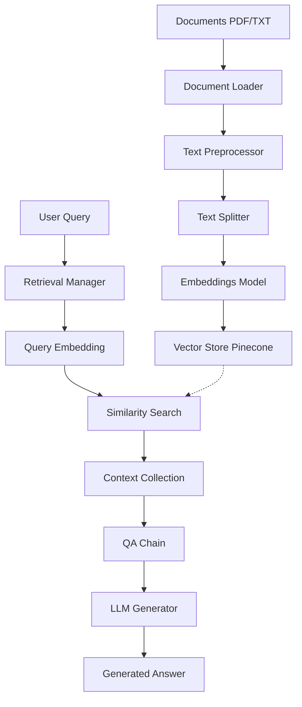

# System Architecture

The Local RAG System is designed with modularity and local execution in mind. It follows a classic RAG pattern:

## High-Level Data Flow

## Component Breakdown

### 1. Document Ingestion (`src/document_loader.py`)

- **PyPDFLoader**: Specifically for parsing PDF structures.
- **DirectoryLoader**: For processing multiple text files.
- **Metadata Extraction**: Captures source paths and page numbers.

### 2. Text Processing (`src/text_processor.py`)

- **RecursiveCharacterTextSplitter**: The core chunking engine. It intelligently splits text by trying various separators (paragraphs, sentences, spaces) to keep semantic units intact.
- **Normalization**: Standardizes whitespace and unicode.

### 3. Embeddings (`src/embeddings.py`)

- **Model**: `all-MiniLM-L6-v2` via HuggingFace.
- **Dimension**: 384.
- **Local Execution**: Runs on CPU using `sentence-transformers`.

### 4. Vector Storage (`src/vector_store.py`)

- **Pinecone**: Used for high-speed similarity search.
- **Batching**: Ensures efficient upsert of large document collections.
- **Score Ranking**: Returns documents with similarity scores for filtering.

### 5. Retrieval & QA (`src/retrieval.py`)

- **RetrievalQA**: orchestrates the retrieval of documents and the passing of context to the LLM.
- **Stuff Chain**: All retrieved documents are "stuffed" into the prompt context.

### 6. Generation (`src/generator.py`)

- **FLAN-T5-Base**: An instruction-tuned model.
- **Prompt Engineering**: Uses structured templates for Grounded QA.

## Rationale for Tech Choices

- **LangChain**: Provides the industry-standard glue for LLM applications.
- **HuggingFace**: Offers access to high-quality, lightweight models that run locally.
- **Pinecone**: Provides a robust, cloud-native vector database (free tier) to remove the overhead of managing local search indexes for larger sets of data.
- **Click/Rich**: Ensures a premium developer experience in the terminal.
